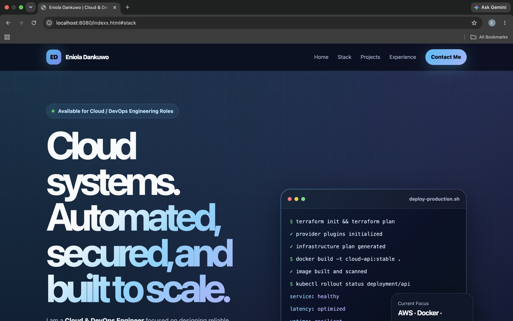
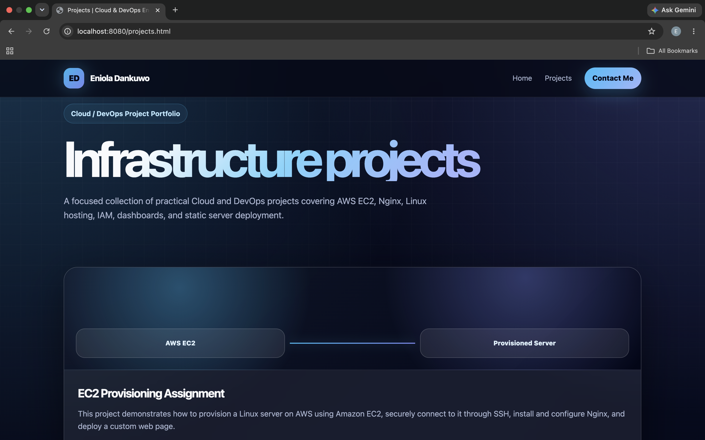
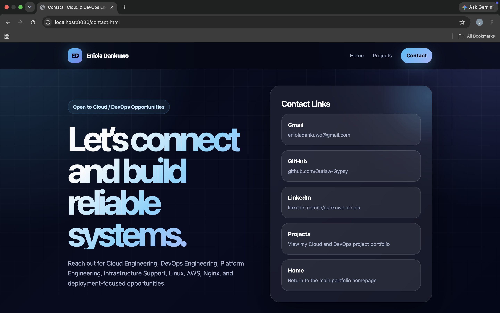
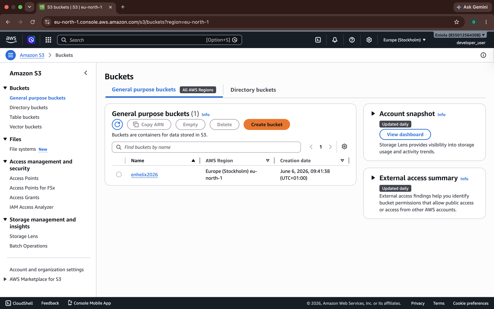
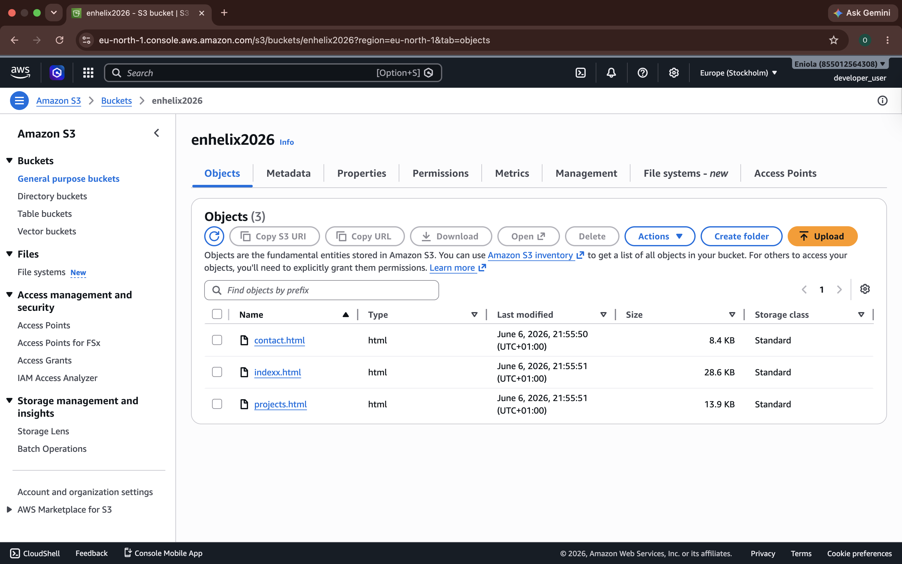
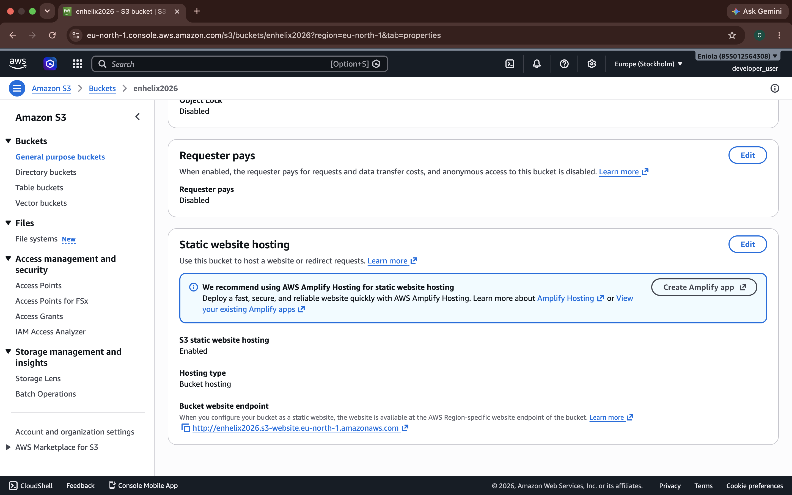
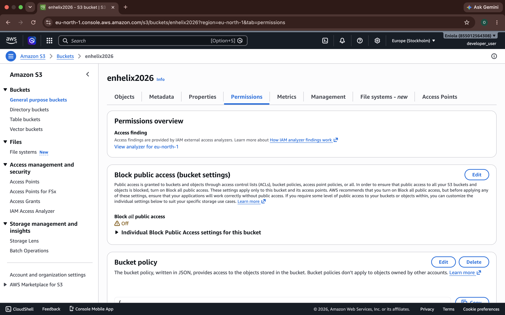
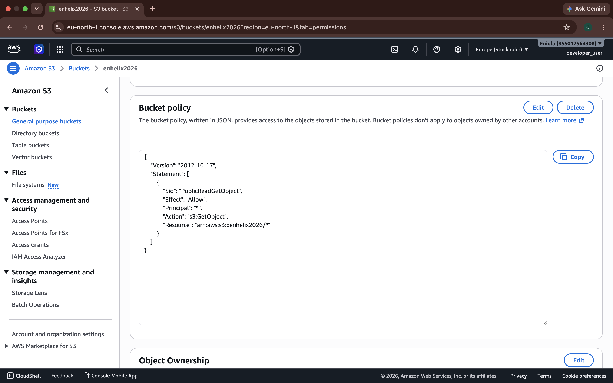

# Static Cloud Portfolio Website Hosted on AWS S3

## Project Overview

This project documents the deployment of a static Cloud/DevOps portfolio website using **HTML**, **CSS**, and **Amazon S3 Static Website Hosting**.

The website contains three main pages:

- `indexx.html` - Homepage
- `projects.html` - Projects page
- `contact.html` - Contact page with Gmail, GitHub, and LinkedIn links

The purpose of this project is to demonstrate how a static website can be built, uploaded, configured, and publicly hosted using an AWS S3 bucket.

This project is beginner-friendly and also demonstrates practical Cloud/DevOps skills such as:

- Object storage
- Static website hosting
- S3 bucket permissions
- Bucket policy configuration
- Public website deployment
- Troubleshooting broken links
- Cloud documentation
- Git and GitHub workflow

---

## Live Website

```text
http://enhelix2026.s3-website.eu-north-1.amazonaws.com/indexx.html
```
## Website Preview

### Homepage Screenshot


### Projects Page Screenshot


### Contact Page Screenshot


---

## Technologies Used
- HTML5
- CSS3
- AWS S3
- S3 Static Website Hosting
- AWS Bucket Policy
- Linux Terminal
- Git
- GitHub

---

## Project Architecture
```
User Browser
     |
     v
AWS S3 Static Website Endpoint
     |
     v
S3 Bucket: enhelix2026
     |
     v
Static HTML Files
```

```
+----------------+
| User Browser   |
+----------------+
        |
        v
+-----------------------------+
| S3 Static Website Endpoint  |
+-----------------------------+
        |
        v
+-----------------------------+
| S3 Bucket: enhelix2026      |
+-----------------------------+
        |
        v
+-----------------------------+
| indexx.html                 |
| projects.html               |
| contact.html                |
+-----------------------------+
```

---
## Project File Structure
```
static-portfolio-server/
│
├── indexx.html
├── projects.html
├── contact.html
├── README.md
└── screenshots/
    ├── homepage.png
    ├── projects-page.png
    ├── contact-page.png
    ├── s3-bucket-overview.png
    ├── s3-uploaded-files.png
    ├── s3-static-hosting.png
    ├── s3-block-public-access.png
    └── s3-bucket-policy.png
```

---

## File Descriptions
| File            | Description                                         |
| --------------- | --------------------------------------------------- |
| `indexx.html`   | Main homepage of the portfolio website              |
| `projects.html` | Displays Cloud/DevOps projects                      |
| `contact.html`  | Contains Gmail, GitHub, and LinkedIn links          |
| `README.md`     | Project documentation                               |
| `screenshots/`  | Stores screenshots used in the README documentation |

---

## What I Built
I created a static portfolio website for a Cloud/DevOps Engineer profile.

The homepage links to the projects and contact pages, allowing visitors and recruiters to move through the website easily.

The projects page contains Cloud/DevOps-related projects such as:

- EC2 Provisioning Assignment
- Nginx Webserver Project
- Nginx Mini Dashboard
- AWS IAM Management Lab
- Static Portfolio Server

The contact page contains links to professional platforms such as:

- Gmail
- GitHub
- LinkedIn

---

## AWS S3 Hosting Steps

## Step 1: Create an S3 Bucket

To host the static website, I first created an Amazon S3 bucket.

### What I clicked in the AWS Console

1. I logged in to the **AWS Management Console**.
2. In the search bar at the top, I searched for **S3**.
3. I clicked on **S3** to open the Amazon S3 dashboard.
4. On the S3 dashboard, I clicked **Create bucket**.
5. Under **Bucket name**, I entered:

```text
enhelix2026
```
6. Under AWS Region, I selected:
```text
Europe (Stockholm) eu-north-1
```
7. I left the other basic settings as default at this stage.
8. I scrolled down and clicked Create bucket.

### Result
After creating the bucket, AWS created an empty S3 bucket named:
```text
enhelix2026
```
This bucket was later used to store and serve the static website files.


## Step 2: Upload Website Files

After creating the bucket, I uploaded the static website files into the S3 bucket.

### What I clicked in the AWS Console
From the S3 dashboard, I clicked on the bucket named:
```text
enhelix2026
```
2. Inside the bucket, I clicked the Objects tab.
3. I clicked Upload.
4. I clicked Add files.
5. I selected the website files from my local computer:
```text
indexx.html
projects.html
contact.html
```
6. After selecting the files, I clicked Upload.
7. I waited for AWS to complete the upload.
8. After the upload finished, I clicked Close or returned back to the bucket objects page.
### Result
The three HTML files were successfully uploaded into the S3 bucket.
```text
indexx.html
projects.html
contact.html
```


## Step 3: Enable Static Website Hosting

After uploading the HTML files, I enabled static website hosting on the bucket.

### What I clicked in the AWS Console
1. Inside the enhelix2026 bucket, I clicked the Properties tab.
2. I scrolled down to the Static website hosting section.
3. I clicked Edit.
4. Under Static website hosting, I selected Enable.
5. Under Hosting type, I selected Host a static website.
6. In the Index document field, I entered:
```text
indexx.html
```
7. I left the Error document field empty or optional.
8. I scrolled down and clicked Save changes.

### Result
Static website hosting was enabled for the S3 bucket.

AWS generated a static website endpoint for the bucket:
```text
http://enhelix2026.s3-website.eu-north-1.amazonaws.com
```
The full homepage URL became:
```text
http://enhelix2026.s3-website.eu-north-1.amazonaws.com/indexx.html
```


## Step 4: Disable Block Public Access

By default, AWS blocks public access to S3 buckets for security reasons.

Since this project is a public portfolio website, I had to update the bucket permission settings so that visitors could view the uploaded HTML files in a browser.

### What I clicked in the AWS Console
1. Inside the enhelix2026 bucket, I clicked the Permissions tab.
2. I located the Block public access section.
3. I clicked Edit.
4. I unchecked the public access blocking options.
5. I understood the warning that the bucket could become public.
6. I clicked Save changes.
7. AWS asked for confirmation.
8. I typed the required confirmation text:
```text
confirm
```
9. I clicked Confirm.

### Result

The bucket was now allowed to have public access permissions.

This step did not automatically make the files public by itself, but it allowed me to add a bucket policy in the next step that gives public read access to the website files.


## Step 5: Add a Bucket Policy

After disabling Block Public Access, I added a bucket policy to allow public read access to the objects inside the bucket.

This allowed visitors to open the HTML files through the S3 static website endpoint.

### What I clicked in the AWS Console
1. Inside the enhelix2026 bucket, I clicked the Permissions tab.
2. I scrolled down to the Bucket policy section.
3. I clicked Edit.
4. In the policy editor, I pasted the following JSON policy:
```
{
  "Version": "2012-10-17",
  "Statement": [
    {
      "Sid": "PublicReadGetObject",
      "Effect": "Allow",
      "Principal": "*",
      "Action": "s3:GetObject",
      "Resource": "arn:aws:s3:::enhelix2026/*"
    }
  ]
}
```
5. I reviewed the bucket name inside the Resource line to make sure it matched my bucket name:
```text
arn:aws:s3:::enhelix2026/*
```
6. I clicked Save changes.

### Result

The bucket policy was successfully added.

The policy allowed public users to read the files stored inside the bucket.

After saving the policy, the website became publicly accessible from the browser using the S3 website endpoint:
```text
http://enhelix2026.s3-website.eu-north-1.amazonaws.com/indexx.html
```
## Bucket Policy Explanation
| Policy Field             | Meaning                                                               |
| ------------------------ | --------------------------------------------------------------------- |
| `Version`                | Defines the AWS policy language version                               |
| `Statement`              | Contains the permission rule                                          |
| `Sid`                    | Statement ID used to describe the rule                                |
| `Effect`                 | Allows the action                                                     |
| `Principal: "*"`         | Makes the objects publicly readable                                   |
| `Action: "s3:GetObject"` | Allows users to read files from the bucket                            |
| `Resource`               | Applies the permission to all objects inside the `enhelix2026` bucket |

The key permission in this policy is:
```text
s3:GetObject
```
This permission allows visitors to view the uploaded HTML files through the browser.


---

## Important Security Note

This project intentionally allows public read access because it is a static public portfolio website.

However, public access should only be used when the content is meant to be publicly available.

Sensitive files should never be uploaded to a public S3 bucket.

Examples of files that should not be uploaded publicly include:

- AWS access keys
- Secret keys
- .env files
- Private credentials
- Internal company files
- Personal documents
- Backend configuration files
- Database passwords

---

## Common Issue I Solved

During development, one issue I encountered was a broken navigation link.

Some links were pointing to:
```text
project.html
```
But the actual file name was:
```text
projects.html
```
This caused a 404 Not Found error.

The fix was to make sure every internal link matched the exact file name:
```text
<a href="projects.html">Projects</a>
```
This helped me understand the importance of correct file naming and path consistency when deploying static websites.

---

## How to Deploy Updates


Whenever changes are made to the HTML files, the updated files should be uploaded again to the S3 bucket.


Manual Upload Method

1. Open the AWS Console
2. Go to S3
3. Open the enhelix2026 bucket
4. Upload the updated HTML files
5. Test the website endpoint again

--- 

## Skills Demonstrated

This project demonstrates the following Cloud/DevOps skills:

- Static website deployment
- AWS S3 bucket creation
- S3 static website hosting
- Public access configuration
- Bucket policy management
- HTML and CSS website structure
- Linux-based project workflow
- Git and GitHub documentation
- Troubleshooting 404 errors
- Understanding cloud storage permissions
- Hosting public assets using AWS services
- Clear technical documentation

---

## Lessons Learned

Through this project, I learned how to:

- Host a static website using AWS S3
- Configure an S3 bucket for website hosting
- Use bucket policies to allow public read access
- Understand the relationship between bucket permissions and object access
- Troubleshoot broken links and incorrect file paths
- Document a Cloud/DevOps project clearly for beginners and recruiters
- Present technical work in a professional portfolio format

---

## Final Result

At the end of this project, I successfully deployed a static Cloud/DevOps portfolio website using AWS S3.

The site is publicly accessible through the S3 static website endpoint and includes multiple connected HTML pages.

```text
http://enhelix2026.s3-website.eu-north-1.amazonaws.com/indexx.html
```


